# RecordsNext 2.0.0

**RecordsNext by mauz79** è un'applicazione per Fantacalcio Manager che legge gli archivi FCM/FCA, consolida i dati storici della lega e genera record e viste statistiche pubblicabili sul sito FCM.

La versione 2.0 introduce una GUI dedicata, configurazione guidata delle stagioni e delle associazioni storiche, famiglie di record elaborabili separatamente, output JavaScript modulari e visualizzatori HTML.

## Requisiti

- Windows
- Java 21 o superiore
- Fantacalcio Manager e relativi file `.fcm` / `.fca`
- per la pubblicazione: cartella del sito FCM locale

La distribuzione include **UCanAccess 2.0.9.5** e le dipendenze necessarie alla lettura dei database FCM/FCA.

## Avvio rapido

1. Estrarre l'intero archivio `RecordsNext_2.0.0.zip` in una cartella.
2. Avviare `RecordsNext.bat`.
3. Aprire **Configurazione stagioni**.
4. Configurare la lega e almeno una stagione gestita.
5. Salvare la configurazione.
6. Se necessario, completare le associazioni storiche.
7. Configurare le famiglie di record.
8. Avviare l'elaborazione.

`RecordsNext.bat`, `RecordsNext.jar` e la directory `runtime` devono restare nella struttura fornita dalla release.

## Dashboard

La Dashboard è il punto di ingresso principale. Mostra lo stato della configurazione, le famiglie attive e l'accesso alle funzioni principali.

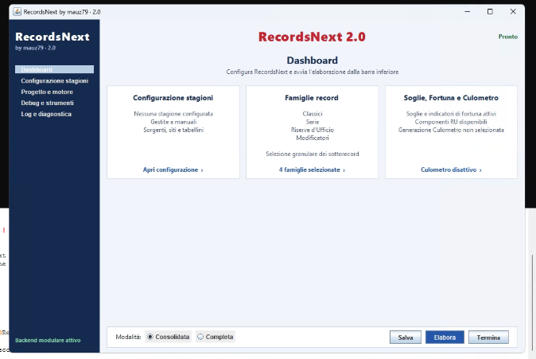

Dalla barra inferiore è possibile scegliere la modalità **Consolidata** o **Completa**, salvare la configurazione e avviare l'elaborazione.

## Configurazione stagioni

Aprire **Configurazione stagioni** dal menu laterale o dalla Dashboard.

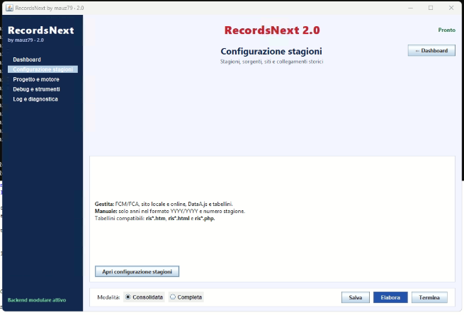

Nella parte superiore vengono definiti:

- **Nome lega**
- **ID lega**

Per ogni stagione gestita possono essere configurati:

- file FCM;
- file FCA;
- cartella del sito locale;
- sito online;
- dati `DataA.js` e tabellini;
- associazioni storiche.

Una stagione configurata e riconosciuta viene mostrata con il proprio stato.

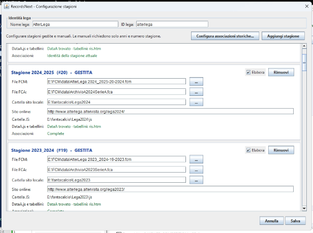

### Aggiungere una stagione

Premere **Aggiungi stagione**.

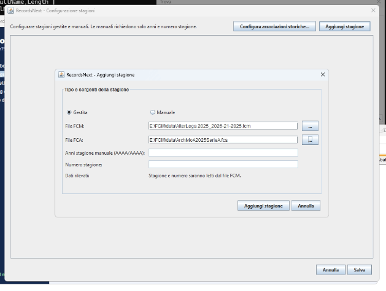

Per una stagione **Gestita**, selezionare i file FCM e FCA. Gli anni e il numero stagione vengono letti dal file FCM quando disponibili.

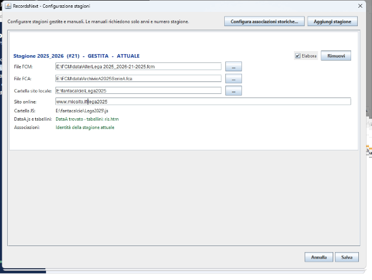

Le stagioni prive di file FCM possono essere inserite come **Manuale**: servono a mantenere corretta la successione storica, ma non vengono elaborate come stagioni FCM.

Al salvataggio, RecordsNext aggiorna automaticamente `config\league.json`, compresa la stagione corrente.

## Associazioni storiche

Le squadre e le competizioni possono cambiare nome nel corso degli anni. RecordsNext consente di collegare le entità stagionali a identità storiche/canoniche.

### Squadre

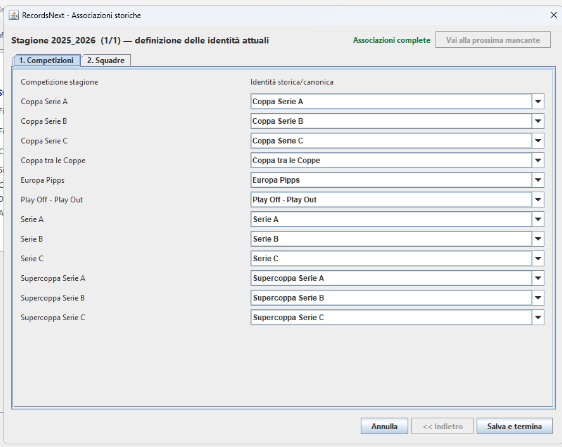

### Competizioni

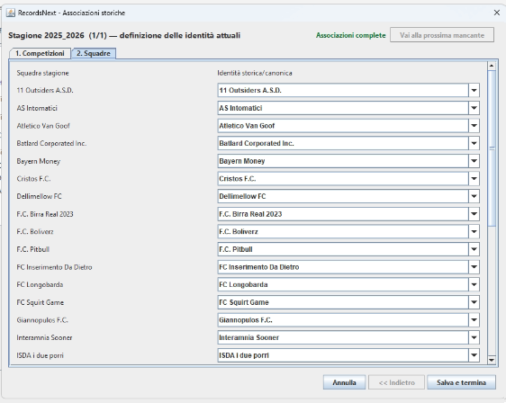

Le associazioni permettono di costruire correttamente record storici anche quando nomi e denominazioni cambiano tra una stagione e l'altra.

## Famiglie di record

La schermata **Famiglie record** permette di scegliere quali dati elaborare.

### Classici

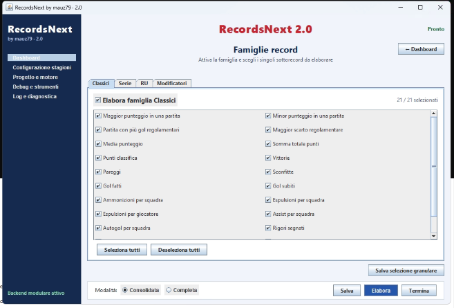

I Classici comprendono record di partita e aggregati come punteggi, risultati, gol, punti classifica, vittorie, pareggi, sconfitte e altri record tradizionali.

### Modificatori

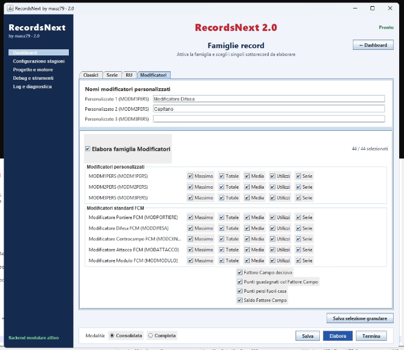

Sono gestiti i modificatori standard FCM, i modificatori personali configurabili e il Fattore Campo. Per ciascun modificatore possono essere selezionate separatamente le statistiche da generare.

Le altre famiglie disponibili comprendono:

- Serie
- Riserve d'Ufficio
- Soglie e Fortuna
- Culometro

Il **Culometro** è opzionale e viene prodotto soltanto quando viene esplicitamente abilitato.

## Modalità di elaborazione

### Consolidata

È la modalità normale per l'aggiornamento durante la stagione. Riutilizza gli archivi già costruiti e aggiorna ciò che è necessario.

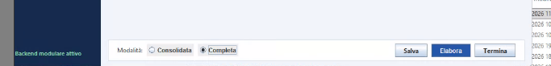

### Completa

Rigenera i dati derivati di tutte le stagioni gestite usando la logica corrente. Le stagioni manuali restano escluse dall'elaborazione FCM.

## Log e diagnostica

La pagina **Log e diagnostica** mostra le fasi della pipeline e i tempi di elaborazione.

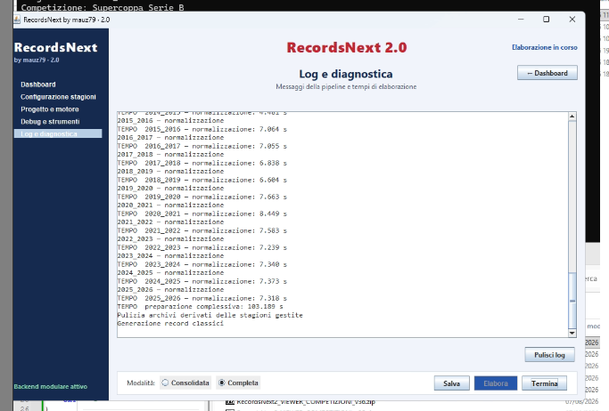

È il primo punto da controllare in caso di problemi durante importazione, normalizzazione, generazione o pubblicazione.

## Pubblicazione e visualizzatori HTML

La sezione **Debug e strumenti** contiene anche gli strumenti collegati alla pubblicazione e all'installazione degli esempi HTML.

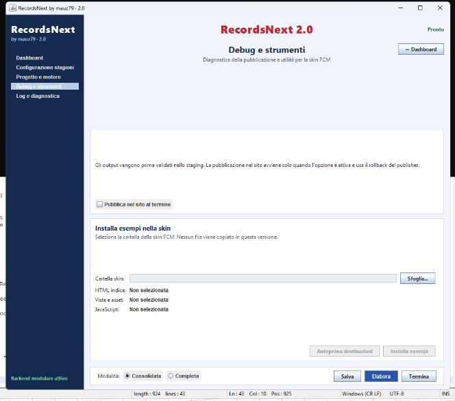

I visualizzatori distribuiti sono statici: non contengono i dati della lega. I dati vengono prodotti da RecordsNext sotto forma di file JavaScript.

Gli output principali sono:

```text
fcmRecordsNext_Core.js
fcmRecordsNext_Manifest.js
fcmRecordsNext_Classics.js
fcmRecordsNext_Series.js
fcmRecordsNext_RU.js
fcmRecordsNext_Modifiers.js
fcmRecordsNext_ThresholdsLuck.js
fcmRecordsNext_Culometro.js
```

I JS pubblici devono stare nella cartella `js` del sito FCM.

La struttura prevista è:

```text
<root sito>\
│
├─ recordsnext.html
├─ js\
│  ├─ fcmRecordsNext_Core.js
│  ├─ fcmRecordsNext_Manifest.js
│  ├─ fcmRecordsNext_*.js
│  ├─ fcmRecordsNextFunzioni_common.js
│  └─ fcmRecordsNextFunzioni_viewer.js
│
└─ RecordsNext\
   ├─ classici.html
   ├─ serie.html
   ├─ riserve_ufficio.html
   ├─ modificatori.html
   ├─ soglie_fortuna.html
   ├─ culometro.html
   ├─ record_di_lega.html
   └─ recordsnext.css
```

Sono inclusi i profili grafici:

- `mauzstrom`
- `fantablue2`
- `neutral`

Il profilo `mauzstrom` usa **Trebuchet MS**.

## Tabellini

Ogni stagione può essere associata a un sito locale e a un sito online. I record basati su singole partite possono quindi collegarsi al relativo tabellino.

RecordsNext supporta pagine risultato `ris.htm`, `ris.html` e `ris.php` quando coerenti con il sito configurato.

## Aggiornamento ordinario durante la stagione

Il flusso tipico è:

1. aggiornare Fantacalcio Manager;
2. avviare RecordsNext;
3. usare **Consolidata**;
4. elaborare;
5. generare/pubblicare i JS;
6. controllare il visualizzatore.

La modalità **Completa** va usata per ricostruzioni integrali, modifiche importanti alla logica o rigenerazioni dello storico.

## Struttura della distribuzione

```text
RecordsNext_2.0.0\
│
├─ RecordsNext.jar
├─ RecordsNext.bat
├─ README.md
├─ INSTALL.txt
├─ CHANGELOG.md
│
├─ runtime\
│  └─ ucanaccess\
│
├─ config\
├─ visualizzatori\
├─ docs\
│  └─ screenshots\
└─ tools\
```

La directory `runtime\ucanaccess` contiene UCanAccess 2.0.9.5, le sue dipendenze e le relative licenze.

## Configurazione locale

I file generati dall'utente, i percorsi FCM/FCA, il database locale e i dati della propria lega non fanno parte degli esempi statici della distribuzione.

Non copiare configurazioni di un'altra lega senza verificarne percorsi, stagioni e associazioni.

## Documentazione

- `README.md` — panoramica e funzionamento
- `INSTALL.txt` — installazione e primo avvio
- `CHANGELOG.md` — cronologia della release
- `docs\INSTALLAZIONE_VISUALIZZATORI_HTML.md` — visualizzatori e pubblicazione
- `docs\screenshots\` — schermate di riferimento

## Autore

**RecordsNext by mauz79**
