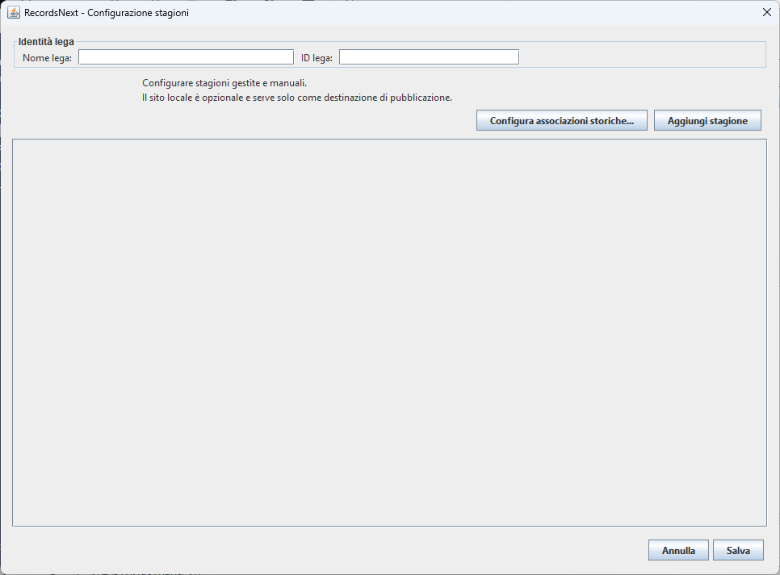
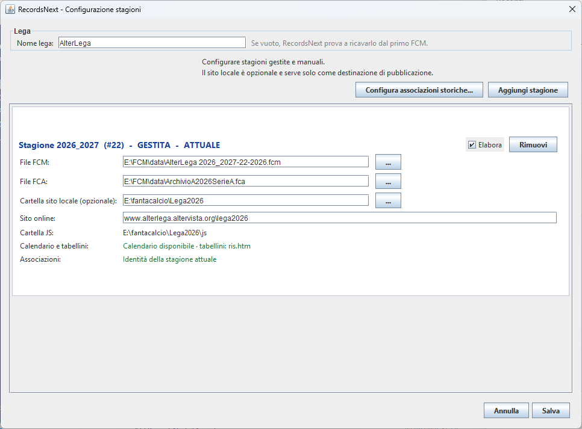
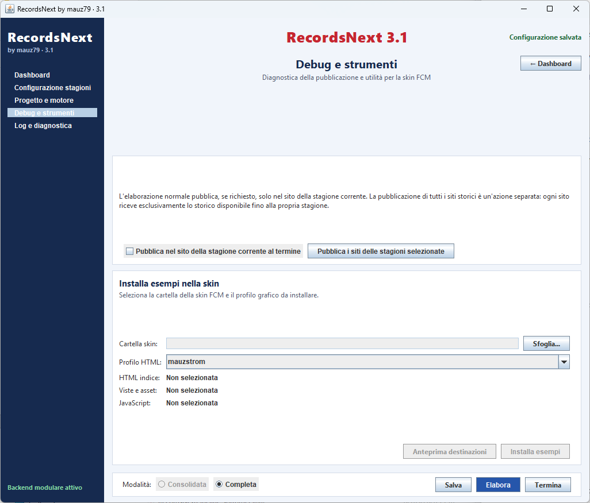
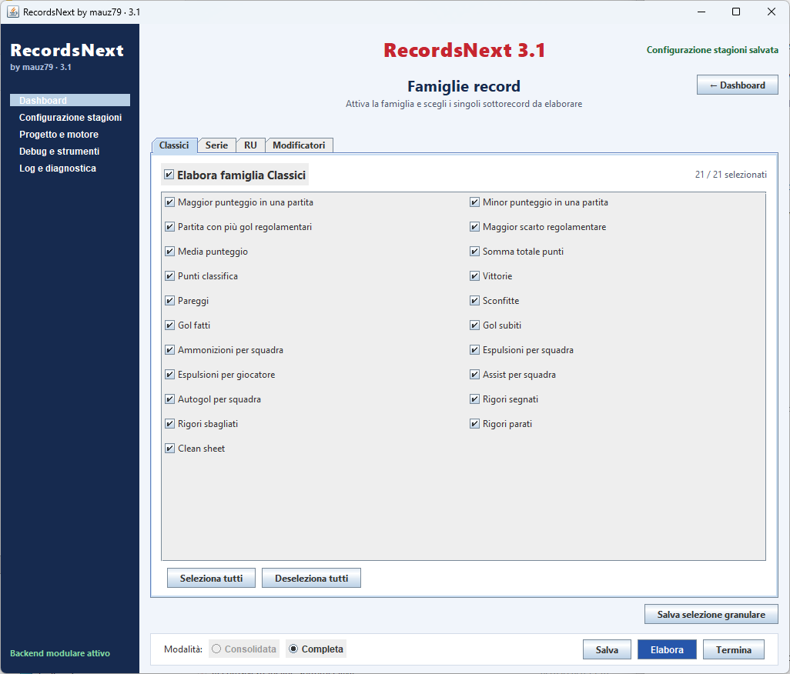
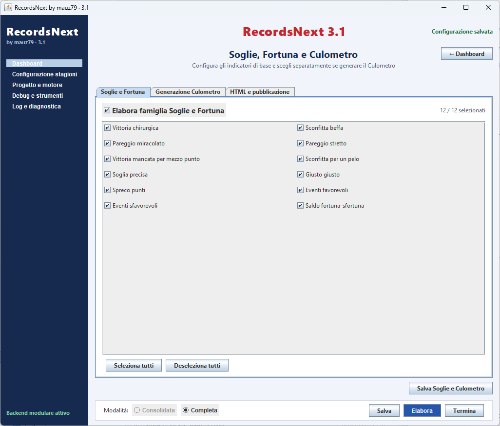
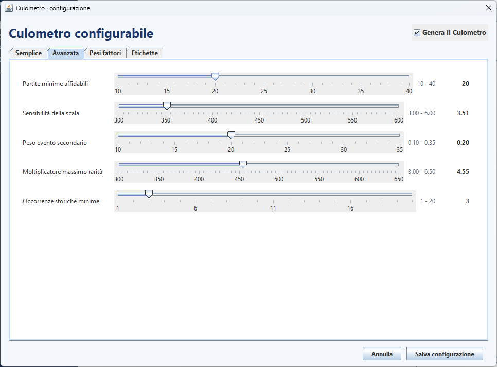

# RecordsNext 3.1

**RecordsNext by mauz79** genera record e statistiche storiche multistagione per leghe gestite con Fantacalcio Manager.

La 3.1 separa definitivamente le **sorgenti storiche** dalle **destinazioni di pubblicazione**: FCM, FCA e calendari alimentano lo storico; ogni sito FCM è una destinazione opzionale e riceve solo i dati disponibili fino alla propria stagione.

## Funzioni principali

- storico multistagione con identità canoniche di squadre e competizioni;
- Classici, Serie, Riserve d'Ufficio, Modificatori, Soglie/Fortuna e Culometro;
- dataset pubblico `fcmRecordsNext_Matches.js`, con due righe per partita;
- link ai tabellini storici;
- pubblicazione nel solo sito corrente per l'uso ordinario;
- riallineamento di più siti storici con **Pubblica i siti delle stagioni selezionate**;
- ogni sito riceve esclusivamente lo storico fino alla propria stagione;
- calendari DataA 1991-2026 inclusi nell'installazione;
- sito locale opzionale per stagione.

## Installazione

Scaricare dalla release il solo file:

`RecordsNext_3.1.0_SETUP.exe`

Avviarlo con doppio click e scegliere la cartella di installazione. Convenzione consigliata:

`<cartella FCM>\plugin\RecordsNext`

Requisito: **Java 21 o superiore**.

Il setup non installa database personali, non copia FCM/FCA e non pubblica automaticamente nei siti.

## Prima configurazione

Aprire **Configurazione stagioni** e aggiungere almeno una stagione gestita indicando FCM e FCA.

Per una stagione **Gestita**:

- FCM obbligatorio;
- FCA obbligatorio;
- sito locale opzionale;
- sito online opzionale;
- calendario recuperato dall'archivio interno RecordsNext.

Per una stagione **Manuale** servono soltanto anni e numero stagione.

Il nome lega può essere lasciato vuoto: RecordsNext prova a ricavarlo dal primo FCM. L'identificativo interno della lega non viene richiesto all'utente.

### URL del sito online

Usare un URL completo, per esempio:

`http://www.example.org/lega2026`

RecordsNext normalizza automaticamente slash e protocollo; se il protocollo manca viene aggiunto `http://`.

## Elaborazione

Per l'uso giornata per giornata:

1. selezionare **Consolidata** quando disponibile;
2. lasciare selezionate le stagioni da elaborare;
3. spuntare **Pubblica nel sito della stagione corrente al termine**;
4. premere **Elabora**.

Per ricostruzioni integrali usare **Completa**.

## Pubblicazione storica

La funzione **Pubblica i siti delle stagioni selezionate** serve per riallineamenti dopo modifiche globali, nuove versioni o correzioni dello storico.

Ogni sito riceve soltanto le stagioni fino al proprio `sort_order`: nessun sito storico riceve dati futuri.

## Famiglie record

Sono disponibili:

- Classici;
- Serie;
- Riserve d'Ufficio;
- Modificatori;
- Soglie e Fortuna.

Il Culometro è opzionale e configurabile separatamente.

## Output JavaScript

RecordsNext pubblica nella cartella `js` del sito:

- `fcmRecordsNext_Core.js`
- `fcmRecordsNext_Classics.js`
- `fcmRecordsNext_Series.js`
- `fcmRecordsNext_RU.js`
- `fcmRecordsNext_Modifiers.js`
- `fcmRecordsNext_ThresholdsLuck.js`
- `fcmRecordsNext_Culometro.js`
- `fcmRecordsNext_Matches.js`
- `fcmRecordsNext_Manifest.js`

## Stato 3.1

La pubblicazione multisito è stata verificata su 21 stagioni gestite, da `2006_2007` a `2026_2027`: 189 file validati e 189 pubblicati senza errori.

UCanAccess utilizzato: `2.0.9.5`.
