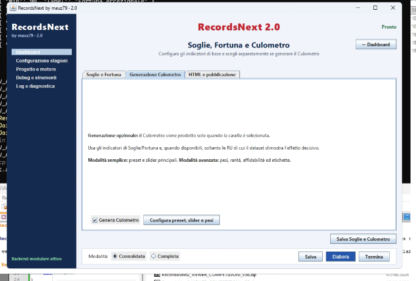
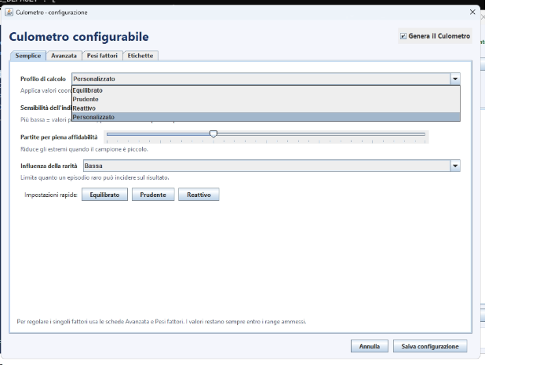
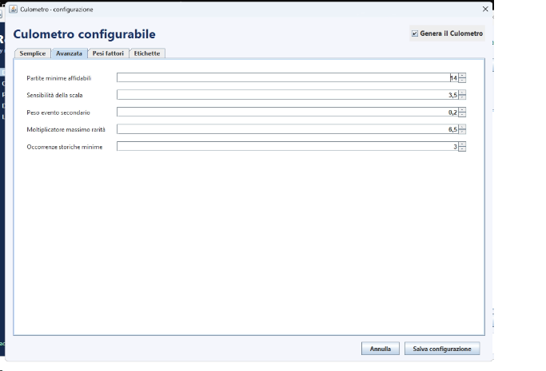
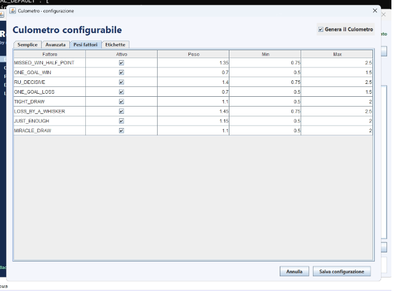
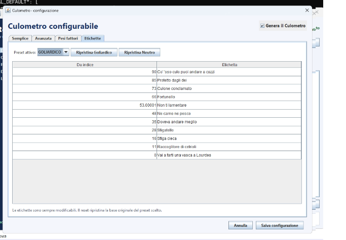
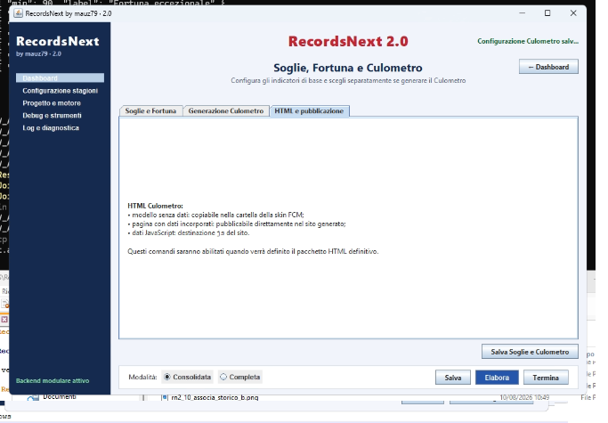
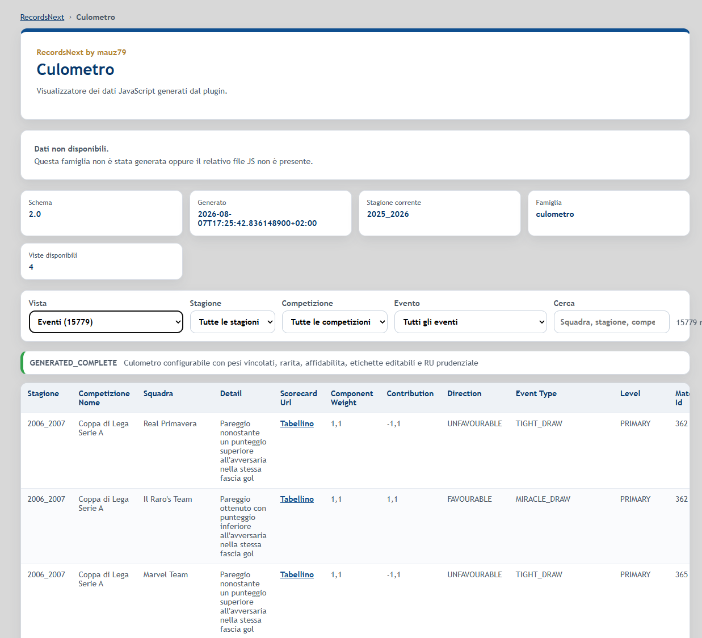

# Culometro — RecordsNext 2.0.0

Il **Culometro** è una famiglia opzionale di RecordsNext che prova a sintetizzare, su base storica, quanto una squadra abbia beneficiato o subito eventi favorevoli e sfavorevoli.

Non viene generato automaticamente: deve essere esplicitamente abilitato.



## Principio generale

Il Culometro non usa un singolo evento. Combina più componenti, ognuno con un peso configurabile, e normalizza il risultato rispetto alle partite considerate.

La configurazione attuale usa:

```json
"minimumMatches": 14
"normalization.mode": "PER_MATCH"
"normalization.centerOnHistoricalMean": true
"normalization.kScale": 3.5
```

Quindi il risultato viene rapportato alle partite disputate e centrato sulla media storica, evitando che una squadra con più gare accumulate venga premiata o penalizzata soltanto per il volume di partite.

## Attivazione e profilo semplice

Nel pannello **Soglie, Fortuna e Culometro**, scheda **Generazione Culometro**, la casella **Genera il Culometro** abilita o disabilita completamente la famiglia.

Il pulsante **Configura preset, slider e pesi** apre la configurazione.



La modalità semplice permette di scegliere un profilo di calcolo. Nella configurazione mostrata sono disponibili:

- Equilibrato
- Prudente
- Reattivo
- Personalizzato

I controlli semplificati regolano in modo guidato:

- sensibilità dell'indice;
- numero di partite richieste per una piena affidabilità;
- influenza della rarità.

Per modificare direttamente i parametri numerici si usa la scheda **Avanzate**.

## Parametri avanzati



La configurazione attuale usa:

| Parametro | Valore |
|---|---:|
| Partite minime affidabili | 14 |
| Sensibilità della scala (`kScale`) | 3,5 |
| Peso evento secondario | 0,2 |
| Moltiplicatore massimo rarità | 6,5 |
| Occorrenze storiche minime | 3 |

### Partite minime affidabili

`minimumMatches = 14`

Il Culometro considera l'indice sufficientemente affidabile solo dopo almeno 14 partite. Questo riduce l'effetto di oscillazioni molto forti nelle prime giornate.

### Sensibilità della scala

`kScale = 3.5`

Controlla quanto rapidamente gli scostamenti rispetto alla media storica si riflettono nell'indice finale.

### Eventi secondari

La strategia di sovrapposizione è:

```json
"strategy": "PRIMARY_PLUS_SECONDARY"
"secondaryWeight": 0.2
"maxSecondary": 1
```

Un evento principale può quindi ricevere il contributo di un solo evento secondario, pesato al 20%.

I tag non contribuiscono al punteggio nella configurazione attuale:

```json
"tagWeight": 0.0
```

### Rarità

La rarità è attiva:

```json
"rarity.enabled": true
"rarity.profile": "NORMAL"
"rarity.maximumMultiplier": 6.5
"rarity.minimumHistoricalOccurrences": 3
```

Gli eventi più rari possono quindi pesare maggiormente, fino al limite impostato, ma il sistema richiede almeno tre occorrenze storiche prima di considerarne affidabile la frequenza.

## Pesi dei fattori



La configurazione 2.0.0 mostrata negli screenshot usa questi componenti:

| Fattore | Peso | Min | Max |
|---|---:|---:|---:|
| `MISSED_WIN_HALF_POINT` | 1,35 | 0,75 | 2,50 |
| `ONE_GOAL_WIN` | 0,70 | 0,50 | 1,50 |
| `RU_DECISIVE` | 1,40 | 0,75 | 2,50 |
| `ONE_GOAL_LOSS` | 0,70 | 0,50 | 1,50 |
| `TIGHT_DRAW` | 1,10 | 0,50 | 2,00 |
| `LOSS_BY_A_WHISKER` | 1,45 | 0,75 | 2,50 |
| `JUST_ENOUGH` | 1,15 | 0,50 | 2,00 |
| `MIRACLE_DRAW` | 1,10 | 0,50 | 2,00 |

Ogni componente può essere attivato/disattivato individualmente e il peso può essere modificato soltanto entro il relativo intervallo ammesso.

I pesi non vanno interpretati come probabilità: sono coefficienti con cui RecordsNext combina gli eventi favorevoli e sfavorevoli.

## Etichette



Il punteggio finale può essere accompagnato da etichette descrittive.

La configurazione attuale usa il preset:

```text
GOLIARDICO
```

Sono disponibili due basi predefinite:

- `GOLIARDICO_DEFAULT`
- `NEUTRAL_DEFAULT`

Le etichette possono essere modificate liberamente. Il reset ripristina la base originale del preset scelto.

Il preset goliardico corrente usa queste soglie:

| Da indice | Etichetta |
|---:|---|
| 90 | Co' 'sso culo puoi andare a cazzi |
| 85 | Protetto dagli dei |
| 73 | Culone conclamato |
| 66 | Fortunello |
| 53,00001 | Non ti lamentare |
| 48 | Ne carne ne pesce |
| 35 | Doveva andare meglio |
| 28 | Sfigatello |
| 16 | Sfiga cieca |
| 11 | Raccoglitore di cetrioli |
| 0 | Vai a farti una vasca a Lourdes |

Il preset neutro è disponibile per chi preferisce etichette non goliardiche.

## Output HTML e pubblicazione



Il Culometro usa lo stesso modello di pubblicazione delle altre famiglie RecordsNext:

- dati generati in JavaScript;
- visualizzatore HTML statico;
- pubblicazione nella struttura del sito FCM configurato.

Il file dati della famiglia è:

```text
fcmRecordsNext_Culometro.js
```

Se la generazione del Culometro è disattivata, questo output non deve essere prodotto come famiglia attiva.

## Viewer Culometro



Il visualizzatore contiene più viste. Nella vista **Eventi** compare anche il selettore **Evento**.

Questo selettore è intenzionalmente mostrato soltanto nella vista Eventi.

Sono inoltre disponibili i filtri per:

- stagione;
- competizione;
- ricerca testuale.

Le righe evento possono mostrare, quando disponibili:

- stagione;
- competizione;
- squadra;
- dettaglio dell'evento;
- link al tabellino;
- peso del componente;
- contributo;
- direzione favorevole/sfavorevole;
- tipo evento;
- livello principale/secondario.

## Come interpretarlo

Il Culometro non afferma che una squadra "meriti" o "non meriti" una posizione di classifica. Misura soltanto gli eventi definiti dalla configurazione e il loro peso relativo nello storico disponibile.

Per questo motivo:

- i risultati dipendono dai componenti abilitati;
- i risultati cambiano modificando i pesi;
- la rarità modifica il contributo degli eventi poco frequenti;
- il numero minimo di partite limita l'affidabilità dei campioni piccoli;
- la normalizzazione per partita rende confrontabili squadre con quantità diverse di gare.

## Configurazione distribuita con RecordsNext 2.0.0

La release include `config\culometro.json` come configurazione iniziale del Culometro.

L'utente può modificarla tramite GUI senza intervenire manualmente sul JSON.

I valori documentati in questa pagina corrispondono alla configurazione mostrata negli screenshot della release 2.0.0.
